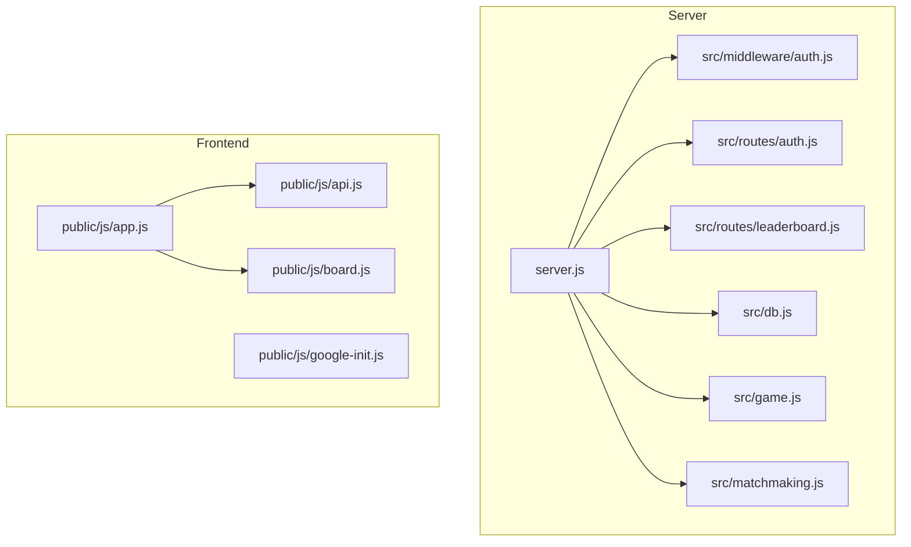

# Project Architect

## Goal
Analyze the full project and produce a structured summary with Mermaid diagrams
showing: file architecture, request flow, and module dependency map.

## Instructions

### Phase 1 — Scan
1. Run `node scripts/scan.js` from the skill directory to collect file tree + sizes.
2. Read these files in order:
   - `server.js` — entry point, middleware chain, route mounting
   - `src/db.js` — DB connection and query patterns
   - `src/middleware/auth.js` — auth logic
   - `src/routes/auth.js`, `src/routes/leaderboard.js` — route definitions
   - `src/game.js`, `src/matchmaking.js` — core game logic
   - `public/js/app.js`, `public/js/api.js`, `public/js/board.js` — frontend entry points

### Phase 2 — Build Diagrams

Output ALL three diagrams in one response.

**Diagram 1 — File Architecture**

(Expand with actual imports found during scan)

**Diagram 2 — HTTP Request Flow**
Trace: Client → server.js → middleware → route handler → db/game → response
Show auth gates, matchmaking queue, and leaderboard endpoints as separate flows.

**Diagram 3 — Module Dependency Map**
Show which modules import which. Use `graph LR` layout.

### Phase 3 — Written Summary

After the diagrams, write:
1. **Entry Point** — what server.js does on startup
2. **Auth Flow** — how login/session works
3. **Game Flow** — matchmaking → game creation → move handling
4. **Data Layer** — what db.js exposes and how it's used
5. **Frontend** — how app.js bootstraps and calls the API
6. **Key risks** — anything that looks fragile or undocumented

## Constraints
- Never modify any file during this skill
- If a file is too large to fully read, summarize top-level exports only
- Always output all 3 Mermaid diagrams, even if partially inferred
- Save the full output to `production_artifacts/architecture.md`