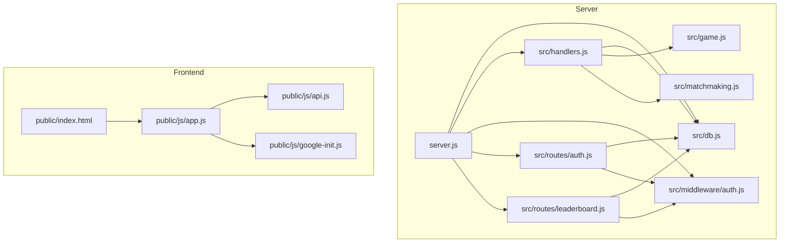
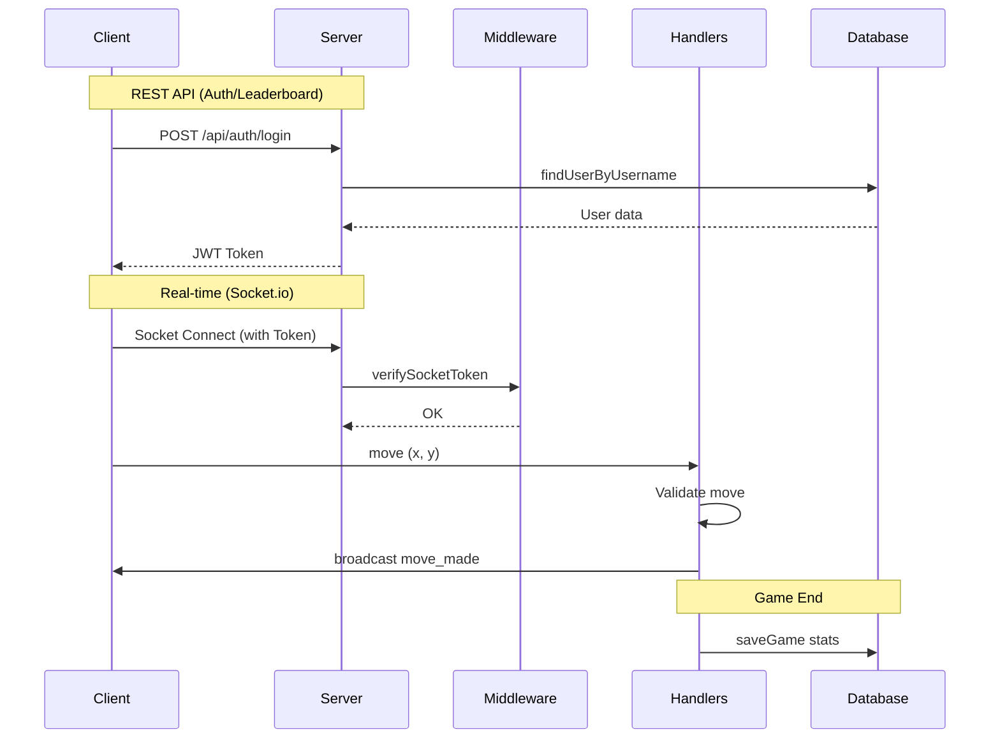
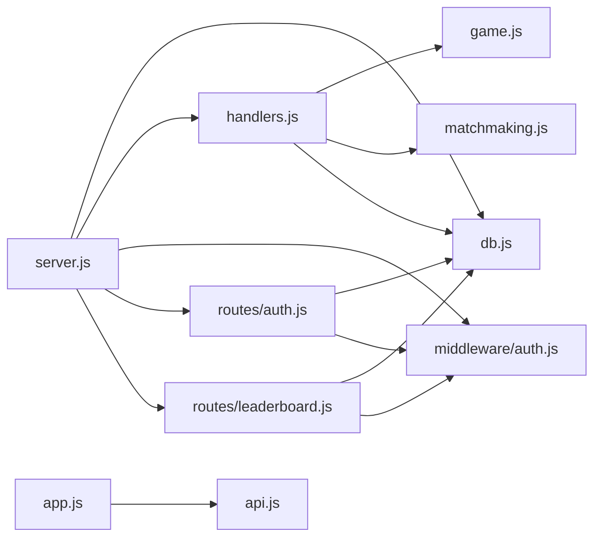

# VNCaro — Architecture Analysis

Analysis of the VNCaro Gomoku (Caro) game platform.

## Architecture Diagrams

### Diagram 1 — File Architecture

### Diagram 2 — HTTP & Socket Flow

### Diagram 3 — Module Dependency Map

---

## Written Summary

### 1. Entry Point
`server.js` serves as the central hub. On startup, it:
- Loads environment variables (`.env`).
- Initializes the SQLite database via `src/db.js`.
- Configures Express for REST APIs and static file serving.
- Sets up a Socket.io server with authentication middleware.
- Mounts REST routes for authentication and leaderboards.
- Initializes the matchmaking ticker in `src/matchmaking.js`.

### 2. Auth Flow
- **Registration/Login**: Handled via `src/routes/auth.js` using bcrypt for password hashing.
- **Google OAuth**: Integrated via `public/js/google-init.js` and server-side validation in `src/routes/auth.js`.
- **Sessions**: Stateless JWT tokens are used. The token is signed in `src/middleware/auth.js` and stored in `localStorage` on the client.
- **Protected Actions**: Both REST routes and Socket.io connections require a valid JWT passed in the `Authorization` header or `handshake.auth`.

### 3. Game Flow
- **Matchmaking**: Players join a queue in `src/matchmaking.js`. A ticker runs every 2s, pairing players with similar ELO (starting with a 100-point range and expanding over time).
- **Game Creation**: Once matched, `src/game.js` creates an in-memory game state.
- **Move Handling**: Managed by `src/handlers.js`. Moves are validated against the `src/game.js` state. The server checks for winners and broadcasts updates to both players and spectators.
- **Persistence**: When a game ends, results and ELO changes are saved to SQLite via `src/db.js`.

### 4. Data Layer
`src/db.js` uses `node:sqlite` (DatabaseSync) for persistent storage. It manages:
- **Users**: Credentials, ELO, and lifetime stats (W/L/D).
- **Games**: Historical record of every match played.
- **Announcements**: Global messages managed by the admin.
- **ELO Logic**: Implements the K-factor logic (40/20/10) to adjust player ratings post-match.

### 5. Frontend
`public/js/app.js` is the main driver. It:
- Initializes the Socket.io client.
- Manages the local game state and DOM updates (board rendering).
- Coordinates with `api.js` for REST calls (auth, leaderboard).
- Handles responsive UI adjustments and sound effects.

### 6. Key Risks
- **Concurrency**: `node:sqlite`'s `DatabaseSync` is synchronous. While fine for low-to-medium traffic, it could block the event loop under extremely high write loads.
- **In-Memory State**: Active games are kept in a `Map` in `src/game.js`. If the server restarts, all ongoing games are lost as they aren't persisted until completion.
- **Cheat Prevention**: While basic move validation exists, there is no explicit server-side check for client-side engine assistance (beyond the "buffing" prevention logic in matchmaking).
- **Matchmaking**: The "3 unique users" condition for matchmaking is undocumented in the UI and might confuse players in low-traffic periods.
